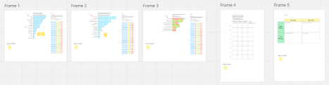

# Participant briefing pack: Online workshop

**Important information**
- Date: 20th June 2025
- Time: 13:00-14:30 (UK)
- Location: Online MS Teams (invite sent to participants)
- [Miro board](https://miro.com/app/board/uXjVI5HNEc4=/) - Please accept
  the email invitation to Miro before accessing

**Actions required by 20th June**

Click ✅ below to jump to each section for further detail.

[✅](#actionMiro) 1. Review Miro – bring questions to the workshop

[✅](#actionSlack) 2. Introduce yourself on RCM Cooperative slack
\#welcome

[✅](#actionAsync) 3. \[Optional\] Asynchronous working if you cannot
attend the workshop

[✅](#actionBios) 4. Review participant bios

------------------------------------------------------------------------

# Table of Contents

1. [Purpose of these sessions](#purpose-of-these-sessions)]
2. [Miro board activities](#miro-board-activities)
3. [Slack](#slack)
4. [Agenda for the online workshop](#agenda-for-the-online-workshop)
5. [What if I can’t attend the workshop?](#what-if-i-cant-attend-the-workshop)
6. [After the workshop](#after-the-workshop)
7. [Participant bios](#participant-bios)

## Purpose of these sessions

### What we want to achieve (objectives) 

- Start to build a network of ADR UK community leaders.
- Start to build out a set of recommendations for how ADR UK can support the health and sustainability of their communities, aligned with ADR UK goals.
- Deliver training in community management principles ("RCM 101") to provide a backbone context to recommendations.
- Provide some experiential learning of equitable collaboration.

### How we want participants to feel (format and tone) 

- You are leaders in the development of ADR UKs recommendations.
- This is supported co-creation - you are being facilitated to contribute your expert knowledge.
- You are at the start of something, building strong new relationships which will continue to add value to your community organising.
- You are empowered to continue to collaborate on this project to deliver final recommendations.
- Your contributions are valued by ADR UK.

## Miro board activities

We will be working collaboratively on a custom Miro board, to enable flexible collection and integration of your expertise. 
To make the most of our workshop time, it would be beneficial for you to access and familiarise yourself with the board before our meeting.

### Accessing the Miro board

You will receive an email invitation to access the Miro board. 
Please follow the instructions in the email from Miro to interact with the material.

### Zoomed out view

On the bottom right of your web browser, you will see the zoom control as shown below.

 
*Figure 1. Miro zoom control on the bottom right of your web browser. Click “+” to zoom in and “-“ to zoom out.*

Initially, we suggest you zoom out so you can see all five “Frames” on the board. In this workshop, we will be focusing on Frames 1-3. We will return to Frames 4 and 5 five in our next session.

 
*Figure 2. Zoomed out view of all Miro “Frames”. Frames 1-3 will be used in this online workshop.*

During the workshop we will be reviewing the feedback already provided by yourselves and earlier groups on your vision for ADR communities, and how we can support participation of your colleagues (“post-its” on Frame 1-3).

Each post-it represents a keyword extracted from feedback. Each keyword is only included once per contributor, therefore the frequency of each keyword is indicative of how many people referenced that issue in their feedback.

After we have reached collective agreement and understanding of the themes identified, we will prioritise which aspects can be practically taken forwards to develop recommendations for the sustainability of ADR communities (voting using the “stars” on Frame 1-3).

We will return to Frames 4 and 5 in our next workshop.

**ACTION REQUIRED BEFORE
20th JUNE** ✅

- Please follow the instructions in the email from Miro to interact with the board.
- Please contact <cassandra.gouldvanpraag@rcmcooperative.com> if you have any issues accessing the board.
- Take a quick look over the feedback keywords and themes they have been collected into.
- You are welcome to note down any questions which arise in the space provided. Click and drag on the “Sticky Stack” to take your own note and leave your question/comment. You are welcome to add your name or remain anonymous as you prefer.

## Slack

We will use the RCM Cooperative Slack Workspace to for informal conversations between participants before, during and after these workshops. 
This is a space for you to connect around issues relating to the management of research communities.

You will have a private channel for participants in this workshop (#adr-community-leaders), and access to the other public channels in the workspace.

If you are not familiar with using Slack, you may find this [Quick Start Guide from The Turing
Way](https://book.the-turing-way.org/community-handbook/communication-channels/slack-start-guide)
helpful.

**ACTION REQUIRED BEFORE
20th JUNE** ✅

- Please accept the invitation to the RCM Cooperative Slack workspace.
- Invites will be sent to the email address you provided in applying for these workshops. Please email
  <cassandra.gouldvanpraag@rcmcooperative.com> if you would like to be added from a different email address.
- Please introduce yourself on \#welcome. In this briefing pack we have shared information about your formal role and interests. On \#welcome, you are invited to share something about your community experience or aspirations!

## Agenda for the online workshop

The below agenda is shared to give you an idea of the structure and purpose of activities for the workshop. Timings may be adjusted on the day!

| Start time (UK) | Activity                                               | Objective                                                                                                                              | Outcome                                                       | Resources                                                                     |
|-----------------|--------------------------------------------------------|----------------------------------------------------------------------------------------------------------------------------------------|---------------------------------------------------------------|-------------------------------------------------------------------------------|
| 13:05           | Welcome and intro                                      | Reinforcing why we are here and the experience we are aiming to create                                                              | Excited and engaged team                                      | ADR UK to set context                                                         |
| 13:15           | Housekeeping and intros                                | Round table names (optional pronouns) Flag welcome and bios Inclusive meeting practice (using hands etc.)                        | Primed for active collaboration Signed into slack and miro | RCM Cooperative slack #welcome Participant briefing pack Miro board  |
| 13:25           | Miro orientation and plan                              | Ensure understanding of the tool and activities; questions on practicalities.                                                       | Ready for collaboration                                       | Miro board                                                                 |
| 13:35           | Frame 1: Vision (What ADR Communities should be)       | 1. Discussion of vision themes    2. Blue stars on which we should carry forward for discussion                                  | Vision longlist                                               | Miro board                                                                 |
| 13:50           | Frame 2: Mission (What ADR Communities should do)      | 1. Discussion of mission themes    2. Blue stars on which we should carry forward for discussion in forming recommendations      | Mission long list                                             | Miro board                                                                 |
| 14:05           | Frame 3: Contribution (How we will support engagement) | 1. Discussion of contribution themes    2. Blue stars on which we should carry forward for discussion in forming recommendations | Contribution long list                                        | Miro board                                                                 |
| 14:20           | Next Steps                                             | Clarify roadmap and understand success of the day                                                                                      | Alignment and preparation for next session.                   |                                                                               |
| 14:30           | Close                                                  |                                                                                                                                        |                                                               |                                                                               |

## What if I can’t attend the workshop?

We understand that circumstances may change and prevent you from joining at our scheduled time.

If you are unable to attend, please still aim to complete the required actions, and participate asynchronously when you have time. Your
contributions may be most effective after the workshop has taken place, so you can review the comments and notes from other attendees.

**OPTIONAL ACTION REQUIRED
BEFORE 1st JULY** ✅

- If you are unable to join the workshop, please [book 30 minutes with Cass](https://calendar.app.google/k7za8eZ6Ffurq7JeA) so you can be supported in indicating your prioritisation and ask any questions.

## After the workshop

We are scheduled to meet again on the 1st July 2025. Between the workshops we will be reviewing your contributions and discussing
your priorities within the ADR UK team. 
No decisions about recommendations will be made without first discussing them with this group, ideally in person at our next meeting. 

At our next workshop, we will be guiding you through formal principles of research community management (“RCM101”) and building out your
recommendations. You will be invited to identify any specific topics or themes which you feel drawn to continue your involvement with.

## Participant bios

Below are the short public biographies shared by participants in these workshops. 
We invite you to take a few minutes to get to know your
fellow contributors! More time will be available for personal introductions when we meet again in July.

**ACTION REQUIRED BEFORE
20th JUNE** ✅

- Review the participant biographies below.

### Harriet Baird (she/her)

Harriet leads on engagement for the Scottish Centre for Administrative Data Research, University of Edinburgh, which is part of ADR Scotland. Her work includes public engagement, policy engagement and knowledge exchange. She is passionate about building networks and impact around data-driven research.

### Dr Pallavi Banerjee (she/her)

Pallavi is an Assistant Professor in the Faculty of Education at the University of Cambridge. Her research focuses on addressing inequalities in educational outcomes for children and young people across the student life cycle, particularly those linked to socioeconomic background. She conducts evaluations utilising experimental and quasi-experimental research designs and synthesises research evidence through systematic reviews. She routinely analyses large-scale datasets to identify factors associated with gaps in attainment and progression, educational behaviour and decision-making, and provides policy advice based on these findings.

### Dr Vickie Barrett (she/her)

Vickie is a Senior Lecturer in Criminology in the Department for Social and Psychological Sciences at the University of Huddersfield, and an ADR UK Research Fellow. Prior to joining academia, Vickie was a teacher and probation officer. Her ADR research project is examining the
relationship between school exclusions and offending using a Ministry of Justice and Department of Education deidentified linked dataset. She is also Deputy Director of the Crime and Policing Research Centre.

### Dr Lola Brookes (she/her)

Lola is a Senior Research Manager at ADR UK, working to smooth the researcher journey when using administrative data in research, in addition, she manages the ADR UK Fellowship Programme. Prior to joining ADR UK, Lola worked within the epidemiology and conservation research sector and more recently, was a Regional Programme Manager at the NC3Rs and the Experimental Design Network Coordinator, for preclinical and animal studies, at the University of Oxford.

### Dr Mike Edwards (he/him)

Mike is Principal Data Linkage Architect at Secure eResearch Platform UK, based at the SAIL Databank at Swansea University. He is responsible for the design, development, and deployment of linkage solutions within the SeRP Linkage Technology arm. His main research interests are in graph-based learning, record linkage, and the effective communication of linkage insights with data owners and users.

### Professor Lucy Griffiths (she/her)

Lucy is a Professor of Paediatric Epidemiology at Swansea University. Lucy’s research focuses on building a better picture of children’s lives, to better outcomes. She utilises administrative and longitudinal cohort study data to examine how social and environmental factors influence the lives of children and young people. A key focus of her research is on vulnerable populations, e.g. those living in poverty, or involved in the family justice system and children’s social care services. She currently works with Administrative Data Research (ADR) Wales and ADR England, Foundations – What Works Centre for Children and Families, the Children's Social Care Research and Development Centre, Nuffield Family Justice Observatory and Health Data Research UK. She is also the Principle Investigator for the ADR UK England and Foundations - What Works Centre for Children and Families funded project on ‘Children at Risk of Poor Outcomes’.

### Dr Cassandra Gould Van Praag (she/her)

Cass is Co-Founder and Executive Director of The RCM Cooperative. She has a PhD in Neuroscience (2014) and 5 years experience building data science communities at the Alan Turing Institute and University of Oxford, with a particular focus on embedding open research practices. With both qualitative and quantitative research expertise, she is a skilled analyst, strategist and creative problem solver. She aims for maximum transparency and reproducibility in her work, and prioritises inclusive and joyful participation. At The RCM Cooperative, she is developing community management training materials, mentoring new research community managers, and facilitating research funding and performing organisations through professional community management practices.

### Dr Katie Hunter (she/her)

Katie is a Lecturer in Criminology at Manchester Metropolitan University (MMU. Her research focuses on processes of criminalisation, specifically on the relationship between experiences of state care and justice systems involvement. She is particularly interested in youth justice and racialised and gendered (in)justices. She recently completed an ADR UK Fellowship, using linked Ministry of Justice and Department for Education data to explore the intersections between ethnicity, care experience and youth justice involvement. The project was partnered with Barnardo’s who completed a complementary qualitative project with Black care-experienced young people in prison, carried out by Listen Up. Findings from the Fellowship were widely reported in the media and have been cited in the House of Lords.   She is one of the co-founders of the Administrative Data for Social Policy (ADSoP) hub at MMU.

### Dr Ezgi Kaya (she/her)

Ezgi is a Senior Lecturer (Associate Professor) in Economics at Cardiff Business School and a Fellow of the Global Labor Organization (GLO). Between 2023 and 2025, she was an ADR UK Research Fellow. With expertise in labour economics and economic demography, Ezgi works with large-scale survey and administrative data using applied methodologies. Her recent research projects explore labour market inequalities, particularly in relation to gender and immigration, the effectiveness of transparency legislation and family-friendly policies in shaping labour market outcomes, the relationship between labour market institutions and fertility, and the role of assortative mating and household interactions in shaping the labour supply behaviour of married women and men. This work has been widely featured in the media and published in high-quality peer-reviewed economics journals.

### Dr Linda Kirkpatrick

Linda is a Research Fellow in the School of Medicine, Dentistry and Biomedical Sciences, Queens University Belfast and has worked as a consultant, economist, analyst, data scientist. Linda takes large datasets and analyses them to provide information in a manner that is easy to understand and consume for even the most non-technical of audiences. Linda’s particular interest is in econometrics and providing data-driven evidence to support policies and research findings.

### Dr Anna Leyland (she/her)

Anna is a Third Century Research Fellow at Manchester Metropolitan University (MMU), an Honorary Fellow at The University of Sheffield, a current Understanding Society Research Fellow, and a former ADR UK Research Fellow. Her work explores the impact of different early life experiences on child development, and how this effects outcome in other areas like education, health, and contact with the justice system. Before becoming a research fellow, Anna worked as a multisystemic therapist, mental health advocate and school counsellor, and as a social researcher for the Department for Education. Her previous research has explored the development of self-regulation in young children, maternal mental health in the perinatal period and the impact on education of poor child health and social deprivation. She is one of the co-founders of the Administrative Data for Policy hub at MMU.

### Dr Louise Marryat (she/her)

Louise is Senior Lecturer in the School of Health Sciences at the University of Dundee. She is a quantitative sociologist with a particular interest in using administrative and birth cohort data to explore various aspects of child development, primarily of children with some sort of vulnerability e.g. they were exposed to opioids during pregnancy, have a neurodevelopmental disorder or were maltreated in the early years. Louise enjoys undertaking public engagement activities is currently the School of Health Sciences Lead for Public Engagement, Enterprise and Impact.

### Dr Ron McDowell (he/him)

Ron is a Research Fellow in the School of Psychology at Ulster University and is one of the Statistical and Methodological Officers in the Administrative Data Research Centre for Northern Ireland. His research interests include structural equation modelling, latent variable modelling, educational and health research.

### Ms Margaret McEvoy (she/her)

Margaret is a  former Senior Civil Servant and Economist with over 35 years’ experience developing policy and applying economics to issues across Government.  She has been Chief Economist at the Office for Manpower Economics, and held senior positions  at the Department for Business, Innovation and Skills, the Monopolies and Mergers Commission and at HM Treasury. Currently Margaret works as economics assessor for HM Treasury. She is also a council member at the Institute of Fiscal Studies and a Governor at Guy's and St Thomas' NHS Trust. She has extensive experience in strategic HR advising on senior level remuneration (pay and pensions) and selecting and recruiting board members and chairs both in government and at a large NHS trust. She is skilled in building research and evidence capacity and in working with boards and academics. 

### Prof Tim McSweeney (he/him)

Tim is the Dawes Chair of Public Protection at Anglia Ruskin University (ARU). Tim joined ARU from the University of Hertfordshire where he was a Senior Lecturer in forensic psychology (between 2018 and 2023). He has previously held roles at Middlesex University, London (2016-2017), Birkbeck, University of London (2010-2015), University of New South Wales, Australia (2009-2013), King's College, London (2003-2010), London South Bank University (1999-2003), and Imperial College, London (1997-1998). In addition to teaching and research posts in academia, Tim has worked in senior research roles with the Home Office Counter-Extremism Unit) and Ministry of Justice (HM Inspectorate of Prisons). Tim is a former ADR UK Research Fellow.

### Dr. Najmeh Modarres (she/her)

Najmeh is Programme Manager at Data and Analytic Research Environments (DARE) UK, where she leads the Community Building programme to co-create a more trustworthy, inclusive, and integrated sensitive data research infrastructure across the UK. With over 15 years of experience in global health and international development, she has managed complex, data-driven programmes that inform health policy and improve outcomes. Before joining DARE UK, Najmeh spent over a decade at the Johns Hopkins University Center for Communication Programs, leading public health research and programme implementation across Africa, the Middle East, the US, and the UK. Her expertise spans social and behaviour change, infectious diseases, reproductive and child health, and community engagement. Najmeh holds a Master of Public Health from Tulane University School of Public Health & Tropical Medicine. She is deeply committed to feminist, anti-racist, and decolonial principles in all aspects of her work.

### Miss Jen Muir (she/her)

Jen is a Senior Data Analyst at Research Data Scotland (RDS) working on Connect4 — a multi-partner project focused on federating data services. Her current role involves evaluating existing services and identifying and communicating areas for change. She also has experience in supporting the work of ADR Scotland, and led on the ingest of new Education datasets into Scotland’s National Safe Haven. Jen came to RDS from Skills Development Scotland, laterally working with economy, labour market, skills, and people data to provide a robust and up-to-date evidence base for decision-makers.

### Mrs Emily Oliver (she/her)

Emily is Head of Training and Capacity Building at the ADR UK Strategic Hub. Emily is responsible for leading on catalytic activities by engaging with Whitehall departments and other government bodies responsible for data access and use. With joint operational oversight of the ADR England strategy, she is focussing on developing training pathways to increase the pool of researchers with skills to create and use linked administrative data. Emily joined ADR UK from the British Red Cross, where she led research in first aid and humanitarian education.

### Ms Elizabeth Pattinson (she/her)

Lizzie is the Research Manager for the Research & Capacity Building Team within the ADR UK Strategic Hub. She oversees the ADR UK studentship cohort and is involved in several workstreams focused on strengthening researchers’ capacity to work with linked administrative data, including engagement events, synthetic data governance, and the development of resources. Prior to joining ADR UK, Elizabeth worked within the Economic and Social Research Council (ESRC), contributing to the management and commissioning of research initiatives related to social inequalities and crime.

### Mrs Karen Powell (she/her)

Karen is Head of Research Strategy and Commissioning for ADR England. Her focus is on providing opportunities for the academic community to access ADR England’s flagship, research-ready data to conduct policy-relevant research, as well as building and nurturing a professional community of administrative data researchers. Karen worked at the Department for Education for a decade before joining the Economic & Social Research Council (ESRC), including various analytical roles, a secondment to a local authority, policy development and running a programme office. At ESRC, Karen took a lead across the What Works Network investments before shaping the ‘service design’ for what has become ADR UK. Karen developed the ADR England Strategy and places a high importance on ensuring research can become useful evidence to inform better decisions for public good.

### Miss Stella Telford (she/her)

Stella joined Research Data Scotland (RDS) as a Data Analyst in November 2023 and works to support the delivery of the ADR Scotland programme. She is currently working on the ingest and update of education datasets into the Scottish National Safe Haven. She has come to her role after graduating from the University of Strathclyde with a master's degree in Data Science for Politics and Policymaking.

### Ms Natalie Terry (she/her)

Natalie is the Senior Communications and Engagement Officer at Research Data Scotland. Prior to joining Research Data Scotland, Natalie held roles in communications and engagement at Heriot-Watt University, Oxfam, New Gorbals Housing Association and Falkirk Council.

### Mr Nick Webster (he/him)

Nick is the Data Partnerships Lead at the Spatial Data Unit at the Department for Levelling Up, Housing and Communities (DLUHC), aiming to increase better sharing and use of data by local government. He is passionate about the use of data for public services and helping government work better through better use of information. Prior to joining DLUHC, Nick was a Senior Analyst in ADR Wales Priority Project Development Team and a Senior Analyst for the Administrative Data Agricultural Collection project. Also, in his role of data analyst, he led on automating many of the data flows for the Welsh Government’s response to the Covid pandemic. Earlier in his career, worked in a range of third sector roles advocating for human rights of persons with disabilities and children for a range of third sector and international organisations in Cambodia, Geneva, UK and Ireland.

### Dr Bogusia Wojciechowska (she/her)

Bogusia is the Senior Research and Impact manager in the Research & Capacity Building Team within the ADR UK Strategic Hub, where she manages the training arm of the team. Her career has been rooted in academic management coupled with a presence in the classroom, which gives her a dual perspective to design and deliver programmes that are both innovative and grounded in real-world learning needs. Bogusia is particularly interested in forging cross-sector partnerships, aligning academic research with government and industry priorities to drive meaningful impact. Bogusia joined ADR UK after a career in higher education in the USA where she was a Dean at a Boston college.

### Dr Xiaohui Zhang (she/her)

Xiaohui Zhang is a Senior Lecturer in Economics at Exeter Business School. Her research interests are in applied micro-econometrics, including cross-sectional and panel data modelling, applied Bayesian econometrics, semi-parametric and non-parametric modelling, and productivity and efficiency analysis. Health economics, environmental economics, and education economics are my major applied areas. Her research topics include mental health, health services utilization, educational attainment, physical and cognitive development of children, and impacts of environmental factors on various economic outcomes.
